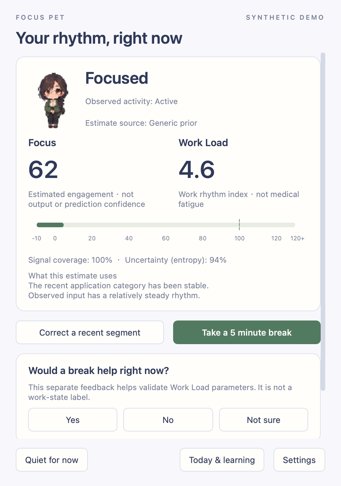

# Focus Pet

A quiet pixel companion for your desktop. Focus Pet estimates work rhythms from local activity counts, offers rest reminders, and learns from voluntary state corrections.

[Try the browser demo](https://yeopbong.github.io/focuspet/) · [中文使用说明](docs/usage-zh.md) · [Privacy](docs/privacy.md)



The browser demo plays synthetic trajectories exported by the Python core. It does not collect desktop activity; the native app uses Python and PySide6.

## Install on macOS

Requires **macOS 14+ on Apple Silicon**. Download `Focus-Pet-0.1.0-macos-arm64.zip` and `SHA256SUMS.txt` from the [release page](https://github.com/yeopbong/focuspet/releases/tag/v0.1.0). Compare the archive's hash with the matching line in `SHA256SUMS.txt`, unzip it, and move `Focus Pet.app` to Applications. Python and dependencies are included.

```sh
shasum -a 256 Focus-Pet-0.1.0-macos-arm64.zip
```

The package is ad-hoc signed, **not Developer ID signed or notarized**. If macOS blocks it, follow [Apple's guidance for opening an app from an unidentified developer](https://support.apple.com/en-us/102445), or install from source. Collection requires your in-app consent and macOS Input Monitoring access. Windows and Linux have no global activity collector in this version.

## Use the companion

Double-click the character to see your state and submit a correction. Right-click for rest, snooze, quiet mode and settings. The menu-bar tray can pause collection or recover a hidden or click-through character. Choose among four characters; each has the same behavior.

The Today dashboard shows the timeline, Focus, Work Load and feedback. Focus estimates engagement, not actual productivity. Work Load is an index with a reference line at 100, not a medical fatigue measurement. Ambiguous or missing observations may show **Unknown**. System Do Not Disturb and full-screen detection are unavailable; use the app's quiet controls.

The initial classifier uses a rule prior. Voluntary corrections can train local model candidates; later independent feedback is needed before activation. Separate wants-rest feedback calibrates workload parameters. Settings show version status and offer rollback. [Model and parameter details](docs/models-and-parameters.md).

No account or upload is required. The app stores aggregate counts and broad application categories, without typed text, window titles, clipboard content, screenshots or pointer coordinates. Local data is not application-encrypted; settings offer retention, export and deletion controls. [Stored fields and controls](docs/privacy.md).

## Run from source

Use **Python 3.11**:

```sh
git clone https://github.com/yeopbong/focuspet.git
cd focuspet
python3.11 -m venv .venv
.venv/bin/python -m pip install -r requirements-macos-arm64.lock
.venv/bin/python -m pip install --no-build-isolation --no-deps -e .
.venv/bin/focuspet demo
```

Use `focuspet doctor` to inspect capabilities and `focuspet run` for normal mode. Declining collection leaves the companion and isolated demo usable.

## Replay and development

```sh
.venv/bin/focuspet scenarios
.venv/bin/focuspet replay reading --output .runtime/reading.json
.venv/bin/focuspet export-demo --scenario workday --output demo
.venv/bin/python -m pytest -q
.venv/bin/python -m ruff check src tests scripts experiments examples .github/scripts
.venv/bin/python -m mypy src/focuspet
.venv/bin/python -m build --no-isolation
```

Qt tests need a desktop session, or `QT_QPA_PLATFORM=offscreen` for headless widgets. `./scripts/build_macos.sh` packages the native app from a clean committed checkout.

[History replay](docs/export-replay.md) · [Architecture](docs/architecture.md) · [Data dictionary](docs/data-dictionary.md) · [Sprite format](docs/characters.md)

The existing five-seed experiments use simulated activity and feedback. Their results do not measure a person's accuracy or improved work habits. [Run the experiments](docs/experiment-protocol.md) · [Results and raw records](experiments/results/report.md).

Source code is [MIT](LICENSE). Character assets use CC0-1.0 to the extent rights can be dedicated; see their manifests. Dependencies retain their [licenses and notices](docs/third-party/README.md).
